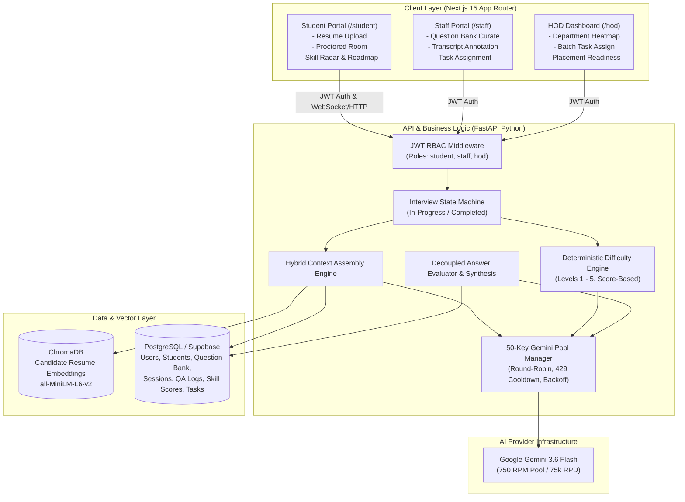

# Axon — AI-Driven Recruiter & HR Assessment Portal
## Comprehensive System Architecture & Technical Specification
**Version:** 1.0.0  
**Target Deployment:** College Placement & Skill Assessment Infrastructure  
**Core Model:** Google Gemini 3.6 Flash (Rotated 50-Key Pool) + Sentence Transformers (`all-MiniLM-L6-v2`) + ChromaDB

---

## 1. Executive Summary & Purpose

**Axon** is an AI-powered technical recruitment and interview assessment platform engineered specifically for academic institutions. It bridges the gap between student preparation and enterprise hiring expectations by providing:
1. **Resume-Grounded, Adaptive AI Interviews**: Interviews conducted in real-time by an adaptive LLM persona that grounds its technical questions in the student's actual uploaded resume, curriculum question banks, and remedial skill tasks.
2. **Dual Interview Modes**:
   - **Practice Mode**: Zero-stakes, low-anxiety environment where detailed feedback and coaching are provided without affecting official institutional scorecards.
   - **Graded Mode**: Official proctored assessment that updates student skill scores and institutional analytics, and automatically clears assigned remediation tasks upon proven mastery.
3. **Staff & HOD Command Center**:
   - **Staff**: Seed department-specific question requirements (must-cover topics), review detailed transcripts and evaluation rubrics, and assign targeted remediation tasks.
   - **HOD (Head of Department)**: Interactive departmental skill heatmaps aggregated via SQL queries across all students, with single-click batch task assignment.

---

## 2. Complete System Architecture



---

## 3. Technology Stack & Decision Matrix

| Layer | Component | Choice | Justification |
| :--- | :--- | :--- | :--- |
| **Frontend** | Framework | **Next.js 15 (App Router)** | Server-side role validation on route transitions (`/student`, `/staff`, `/hod`), React Context for interview state preservation, instant PWA capabilities. |
| **Styling** | UI Design | **Tailwind CSS + Lucide Icons** | High-productivity dashboard layouts, accessible dark-themed interview rooms designed to lower student anxiety. |
| **Backend** | Application Server | **FastAPI (Python 3.13)** | Native async I/O crucial for non-blocking concurrent LLM streaming and evaluation requests. |
| **Relational DB** | Storage & Auth | **PostgreSQL (Supabase / Neon)** | ACID relational consistency for user roles, transcripts, scores, and tasks; native SQL aggregations for HOD heatmaps. |
| **Vector DB** | Embeddings Store | **ChromaDB (Persistent)** | Lightweight, local, zero-overhead storage for candidate resume sections, isolated by candidate UUID. |
| **Embedding Model** | Vectorizer | **`sentence-transformers/all-MiniLM-L6-v2`** | 384-dimensional dense vectors running locally at zero API cost and ultra-low latency. |
| **Primary LLM** | Question & Evaluation | **Google Gemini 3.6 Flash** | Ultra-fast token throughput, large context window, structured JSON output mode, supported by the 50-key rotation pool. |
| **Proctoring** | Anti-Malpractice | **Browser Focus + Clipboard Guard** | `window.onblur` tab-switch detection, clipboard hijack prevention, backend strike accumulation. |

---

## 4. API Key Pool & Rate-Limiting Architecture (50-Key Cluster)

### 4.1. The Capacity Math
* **Single Free Key Quota**: 15 Requests Per Minute (RPM) & 1,500 Requests Per Day (RPD).
* **50-Key Rotated Pool**:
  $$\text{Effective Pool RPM} = 50 \times 15 = 750 \text{ RPM}$$
  $$\text{Effective Pool RPD} = 50 \times 1,500 = 75,000 \text{ RPD}$$
* A standard 25-question interview generates approximately 52 LLM calls (25 question generations, 25 answer evaluations, 1 synthesis, 1 roadmap).
* **Concurrent Capacity**: With 750 RPM, the system can comfortably sustain **30+ students simultaneously taking interviews in real-time** with zero throttling.

### 4.2. Rotation & Resilience Algorithm (`KeyPoolManager`)
1. **Round-Robin Cycling**: A thread-safe circular iterator picks the next available key for each LLM invocation.
2. **Health Tracking & Cooldown**:
   - If an API call encounters HTTP 429 (Resource Exhausted), that specific key is placed in a **60-second cooldown registry**.
   - The request immediately falls back to the next healthy key with zero delay to the student.
3. **Exponential Backoff**: In the improbable event that multiple keys hit limits simultaneously, requests execute an asynchronous jittered backoff ($t = 2^k + \text{rand}(0, 1)$).

---

## 5. RAG & Context Assembly Engine

For each interview question, Axon merges three distinct context layers into a single prompt:

```
+-----------------------------------------------------------------------+
|                       CONTEXT COMPOSER                                |
+-----------------------------------------------------------------------+
| 1. Candidate Resume Chunks:                                           |
|    - Top-k (k=3) similarity search from ChromaDB on current skill/topic|
| 2. Department Question Bank:                                          |
|    - Specific topics marked 'must_cover = True' for this role/dept    |
| 3. Remedial Tasks:                                                    |
|    - Student's open tasks from 'tasks.target_skill'                   |
+-----------------------------------------------------------------------+
                                   |
                                   v
+-----------------------------------------------------------------------+
| Gemini 3.6 Flash: Grounded Question Generator (Difficulty: Level N)   |
+-----------------------------------------------------------------------+
```

---

## 6. Deterministic Difficulty Adaptation Engine

Rather than delegating difficulty scaling to arbitrary LLM decisions, Axon implements a deterministic state machine:

### 6.1. States
* **Levels**: `1` (Foundational / Definitions), `2` (Application / Concepts), `3` (Scenario / Implementation), `4` (Deep Dive / Edge Cases), `5` (Architectural / Systems Optimization).
* **Default Starting Level**: `Level 2`.

### 6.2. Transition Rules
* **Score Scale**: Each answer is graded on a scale of $1.0$ to $10.0$.
* **Promotion Rule**: If the last **two consecutive answers** score $\ge 7.5/10$, bump `difficulty_state += 1` (max 5).
* **Demotion Rule**: If the current answer scores $< 4.0/10$, drop `difficulty_state -= 1` (min 1).
* **Hold Rule**: Any score between $4.0$ and $7.4$ maintains the current difficulty level.
* **Invisible UX**: Difficulty state is completely hidden from the student's UI to avoid gamification or anxiety.

---

## 7. Decoupled Answer Evaluation & Session Synthesis

### 7.1. Decoupled Grading per Turn
* **Separation of Concerns**: Question generation and answer grading never occur in the same LLM prompt.
* **Rubric Schema**:
  ```json
  {
    "score": 8.0,
    "technical_accuracy": "Accurately explained closures and lexical scoping.",
    "areas_for_improvement": "Did not mention memory leak implications.",
    "follow_up_hint": "Consider garbage collection lifecycles."
  }
  ```
* Stored immediately in `qa_log.evaluation_json`.

### 7.2. End-of-Session Synthesis
Once the session reaches the target question count (e.g., 25 turns):
1. The complete `qa_log` is passed to Gemini 3.6 Flash for holistic skill aggregation.
2. Produces quantitative scores:
   - Technical Depth (1–10)
   - Problem Solving & Logic (1–10)
   - Communication Clarity (1–10)
   - Domain Specifics (1–10 per topic)
3. **Practice vs. Graded Gate**:
   - `if mode == "graded"`: Upsert to `skill_scores`. Check if student's score on any open `tasks.target_skill` improved past threshold ($\ge 7.0$). If yes, automatically update `tasks.status = 'completed'`.
   - `if mode == "practice"`: Display full feedback and radar chart to student; **write nothing to official `skill_scores`**.

---

## 8. Relational Data Schema (PostgreSQL)

```sql
-- Core user accounts
CREATE TABLE users (
    id UUID PRIMARY KEY DEFAULT gen_random_uuid(),
    role VARCHAR(20) NOT NULL CHECK (role IN ('student', 'staff', 'hod', 'admin')),
    name VARCHAR(255) NOT NULL,
    email VARCHAR(255) UNIQUE NOT NULL,
    created_at TIMESTAMPTZ DEFAULT NOW()
);

-- Student-specific profiles (ERP Roll No Auth)
CREATE TABLE students (
    user_id UUID PRIMARY KEY REFERENCES users(id) ON DELETE CASCADE,
    roll_number VARCHAR(50) UNIQUE NOT NULL,
    password_hash VARCHAR(255) NOT NULL,
    department VARCHAR(100) NOT NULL,
    year_of_study INT NOT NULL,
    resume_candidate_id UUID
);

-- Staff-curated question criteria
CREATE TABLE question_bank (
    id UUID PRIMARY KEY DEFAULT gen_random_uuid(),
    department VARCHAR(100) NOT NULL,
    role_track VARCHAR(100) NOT NULL,
    topic VARCHAR(255) NOT NULL,
    must_cover BOOLEAN DEFAULT FALSE,
    difficulty_baseline INT DEFAULT 2,
    added_by_staff_id UUID REFERENCES users(id)
);

-- Interview session state machine
CREATE TABLE interview_sessions (
    id UUID PRIMARY KEY DEFAULT gen_random_uuid(),
    student_id UUID NOT NULL REFERENCES users(id),
    mode VARCHAR(20) NOT NULL CHECK (mode IN ('practice', 'graded')),
    status VARCHAR(20) NOT NULL CHECK (status IN ('in_progress', 'completed', 'aborted')),
    difficulty_state INT DEFAULT 2 CHECK (difficulty_state BETWEEN 1 AND 5),
    question_count INT DEFAULT 0,
    max_questions INT DEFAULT 25,
    started_at TIMESTAMPTZ DEFAULT NOW(),
    completed_at TIMESTAMPTZ
);

-- Turn-by-turn question and answer log
CREATE TABLE qa_log (
    id UUID PRIMARY KEY DEFAULT gen_random_uuid(),
    session_id UUID NOT NULL REFERENCES interview_sessions(id) ON DELETE CASCADE,
    turn_index INT NOT NULL,
    question TEXT NOT NULL,
    answer TEXT,
    evaluation_json JSONB,
    created_at TIMESTAMPTZ DEFAULT NOW()
);

-- Student skill radar scores (updated only on graded mode)
CREATE TABLE skill_scores (
    student_id UUID NOT NULL REFERENCES users(id) ON DELETE CASCADE,
    skill_name VARCHAR(100) NOT NULL,
    score NUMERIC(4, 2) NOT NULL,
    updated_at TIMESTAMPTZ DEFAULT NOW(),
    PRIMARY KEY (student_id, skill_name)
);

-- Remediation tasks assigned by staff/HOD
CREATE TABLE tasks (
    id UUID PRIMARY KEY DEFAULT gen_random_uuid(),
    assigned_by_staff_id UUID NOT NULL REFERENCES users(id),
    student_id UUID NOT NULL REFERENCES users(id),
    description TEXT NOT NULL,
    target_skill VARCHAR(100) NOT NULL,
    status VARCHAR(20) DEFAULT 'assigned' CHECK (status IN ('assigned', 'in_progress', 'completed')),
    due_date DATE,
    created_at TIMESTAMPTZ DEFAULT NOW()
);

-- Proctoring strike log
CREATE TABLE proctor_strikes (
    id UUID PRIMARY KEY DEFAULT gen_random_uuid(),
    session_id UUID NOT NULL REFERENCES interview_sessions(id) ON DELETE CASCADE,
    strike_type VARCHAR(50) NOT NULL, -- 'tab_switch', 'blur', 'devtools_open'
    timestamp TIMESTAMPTZ DEFAULT NOW(),
    metadata JSONB
);
```

---

## 9. Next Steps & Phased Execution

1. **Phase 1 (Immediate)**: Establish `KeyPoolManager` with 50-key rotation, health checks, and integrate with `google-genai` using `gemini-3.6-flash`.
2. **Phase 2**: Implement the deterministic `DifficultyEngine` and turn evaluation service.
3. **Phase 3**: Build the Interview State Machine endpoints (`/interview/start`, `/interview/turn`, `/interview/conclude`).
4. **Phase 4**: Establish the database models (SQLAlchemy / Alembic or Supabase client).
5. **Phase 5**: Connect Next.js frontend to the session endpoints.
